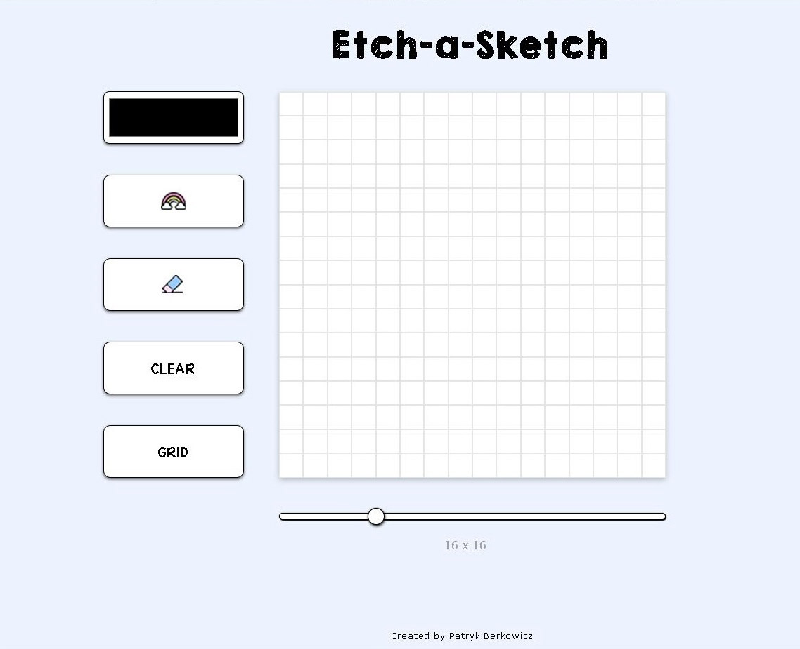
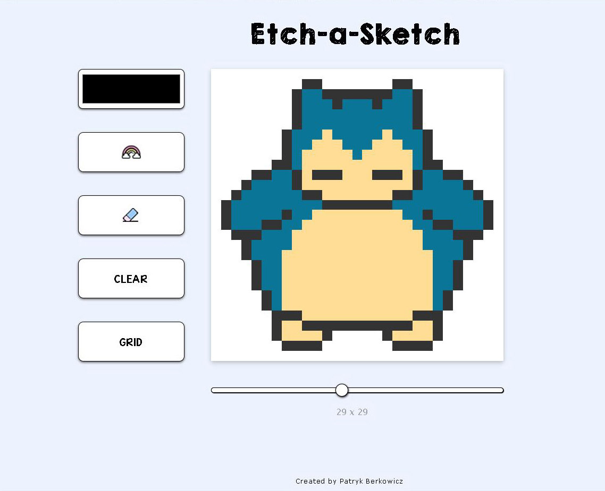

# My Etch-A-Sketch Modern Version

The goal of this repo is to practice the following skill sets:

- HTML
- CSS
- JavaScript
- Chrome DevTools & Debugging
- Git Fundamentals

# Links

- [Live Demo](https://pb-5.github.io/modern-etch-a-sketch/)

## Screenshots

> Desktop 

> Example

